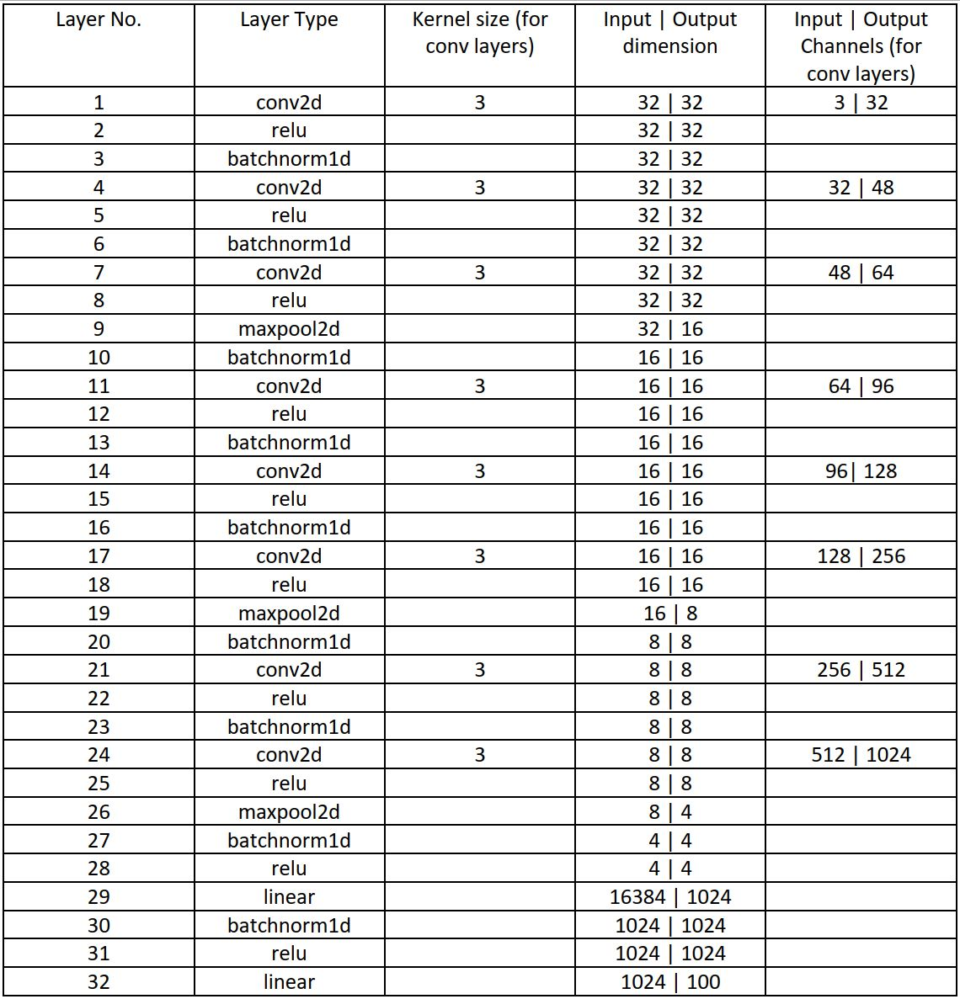

# DeepNet Image Classifier

## Project Overview

The goal of this project is to design and train deep convolutional neural networks using PyTorch. I will design a deep net architecture to classify (small) images into 100 categories and evaluate the performance of the architecture by uploading the predictions to the Kaggle competition. For this project I was working with the [CIFAR100](https://www.cs.toronto.edu/~kriz/cifar.html) dataset. This dataset consists of 60K 32x32 color images from 100 classes, with 600 images per class. There are 50K training images and 10K test images. The images in CIFAR100 are of size 3x32x32, i.e. 3-channel color images of 32x32 pixels. I have modified the standard dataset to create our own CIFAR100 dataset which consists of 45K training images (450 of each class), 5K validation images (50 of each class), and 10K test images (100 of each class). The training and val datasets have labels while all the labels in the test set are set to 0.

## Model Architecture

